# Hướng Dẫn ERP Siêu Chi Tiết Theo Chức Năng (98 bước, không tính dashboard)

Tài liệu này hướng dẫn thao tác sử dụng hệ thống ERP theo từng chức năng nghiệp vụ, dựa trên flow Playwright chạy trực tiếp trên môi trường thật.

## 1. Mục tiêu

1. Hướng dẫn người dùng thao tác từng bước theo từng nhóm chức năng lớn.
2. Bao quát nghiệp vụ thực tế ở cả 3 portal: Admin, Commercial, HR và Personal.
3. Mỗi bước đều có ảnh minh họa, thao tác thực hiện và kết quả mong đợi rõ ràng.

## 2. Cấu trúc chức năng lớn

1. Chức năng 1: Xác thực và chọn portal.
2. Chức năng 2: Admin - Quản lý người dùng.
3. Chức năng 3: Admin - Quản lý vai trò.
4. Chức năng 4: Admin - Quản lý danh mục.
5. Chức năng 5: Admin - Quản lý sản phẩm và thương hiệu.
6. Chức năng 6: Commercial - Đơn hàng, khách hàng, nhà cung cấp, kho hàng, trả hàng, tồn kho.
7. Chức năng 7: HR - Nhân sự, bảng lương, duyệt nghỉ, nghỉ việc, sa thải.
8. Chức năng 8: Commercial nâng cao - Tạo đơn hàng, xuất kho, nhập kho.
9. Chức năng 9: Admin nâng cao - CRUD sản phẩm.
10. Chức năng 10: Personal Portal - Hồ sơ cá nhân, nghỉ phép, phiếu lương, thôi việc.

## 3. Điều kiện trước khi thực hiện

1. Frontend chạy tại http://localhost:4000.
2. Backend/API và database hoạt động bình thường.
3. Tài khoản test có quyền đầy đủ cho cả 3 portal.
4. Có thể thay đổi tài khoản đăng nhập qua biến môi trường:
   - E2E_USERNAME
   - E2E_PASSWORD

## 4. Hướng dẫn thao tác theo chức năng lớn

## 4.1 Chức năng 1: Xác thực và chọn portal

### Bước 1: Đăng nhập thành công
- Thao tác thực hiện: nhập thông tin đăng nhập hợp lệ và bấm Đăng nhập.
- Kết quả mong đợi: hệ thống rời trang login.


### Bước 2: Màn hình chọn portal
- Thao tác thực hiện: quan sát danh sách portal được phân quyền.
- Kết quả mong đợi: hiển thị đầy đủ portal có thể truy cập.


## 4.2 Chức năng 2: Admin - Quản lý người dùng

### Bước 1: Mở danh sách người dùng
- Thao tác thực hiện: vào menu Người dùng.
- Kết quả mong đợi: hiển thị bảng user.


### Bước 2: Mở bộ lọc người dùng
- Thao tác thực hiện: bấm Bộ lọc.
- Kết quả mong đợi: panel filter/search hiển thị.


### Bước 3: Lọc theo username
- Thao tác thực hiện: nhập từ khóa vào ô tìm tên đăng nhập.
- Kết quả mong đợi: danh sách được thu hẹp đúng điều kiện.


### Bước 4: Mở form tạo tài khoản
- Thao tác thực hiện: bấm Tạo tài khoản.
- Kết quả mong đợi: popup Tạo tài khoản mới xuất hiện.


### Bước 5: Đóng form tạo tài khoản
- Thao tác thực hiện: bấm Hủy.
- Kết quả mong đợi: popup đóng, quay lại danh sách user.


## 4.3 Chức năng 3: Admin - Quản lý vai trò

### Bước 1: Mở danh sách vai trò
- Thao tác thực hiện: vào menu Vai trò.
- Kết quả mong đợi: hiển thị bảng vai trò hệ thống.


### Bước 2: Mở bộ lọc vai trò
- Thao tác thực hiện: bấm Bộ lọc.
- Kết quả mong đợi: hiển thị bộ lọc mã/tên/trạng thái vai trò.


### Bước 3: Lọc vai trò theo tên
- Thao tác thực hiện: nhập từ khóa tên vai trò.
- Kết quả mong đợi: bảng vai trò chỉ còn dữ liệu phù hợp.


## 4.4 Chức năng 4: Admin - Quản lý danh mục

### Bước 1: Mở danh sách danh mục
- Thao tác thực hiện: vào menu Danh mục.
- Kết quả mong đợi: hiển thị bảng danh mục.


### Bước 2: Tìm danh mục theo tên
- Thao tác thực hiện: nhập từ khóa trong ô Tên danh mục.
- Kết quả mong đợi: danh sách danh mục lọc đúng từ khóa.


## 4.5 Chức năng 5: Admin - Quản lý sản phẩm và thương hiệu

### Bước 1: Mở danh sách sản phẩm
- Thao tác thực hiện: vào menu Sản phẩm.
- Kết quả mong đợi: hiển thị bảng sản phẩm.


### Bước 2: Mở bộ lọc sản phẩm
- Thao tác thực hiện: bấm Bộ lọc.
- Kết quả mong đợi: hiển thị vùng lọc sản phẩm.


### Bước 3: Lọc sản phẩm theo tên
- Thao tác thực hiện: nhập từ khóa tên sản phẩm.
- Kết quả mong đợi: bảng sản phẩm lọc theo điều kiện.


### Bước 4: Mở danh sách thương hiệu
- Thao tác thực hiện: vào menu Thương hiệu.
- Kết quả mong đợi: hiển thị bảng thương hiệu.


### Bước 5: Mở form thêm thương hiệu
- Thao tác thực hiện: bấm Thêm thương hiệu.
- Kết quả mong đợi: popup tạo thương hiệu mở ra.


### Bước 6: Tạo thương hiệu mới
- Thao tác thực hiện: nhập tên và bấm Tạo mới.
- Kết quả mong đợi: thương hiệu mới xuất hiện trong bảng.


### Bước 7: Mở form sửa thương hiệu
- Thao tác thực hiện: bấm nút sửa ở dòng vừa tạo.
- Kết quả mong đợi: popup chỉnh sửa hiển thị dữ liệu hiện tại.


### Bước 8: Cập nhật thương hiệu
- Thao tác thực hiện: đổi tên và bấm Cập nhật.
- Kết quả mong đợi: bảng phản ánh tên mới.


### Bước 9: Mở xác nhận xóa thương hiệu
- Thao tác thực hiện: bấm Xóa ở dòng vừa cập nhật.
- Kết quả mong đợi: popup xác nhận xóa hiển thị.


### Bước 10: Xóa thương hiệu
- Thao tác thực hiện: xác nhận Xóa.
- Kết quả mong đợi: bản ghi thương hiệu bị xóa khỏi bảng.


## 4.6 Chức năng 6: Commercial - Vận hành bán hàng và kho

### Bước 1: Chọn portal Commercial
- Thao tác thực hiện: đăng nhập và vào trang chọn portal.
- Kết quả mong đợi: vào được portal Commercial.


### Bước 2: Mở danh sách đơn hàng
- Thao tác thực hiện: vào menu Đơn hàng.
- Kết quả mong đợi: hiển thị bảng orders.


### Bước 3: Mở bộ lọc đơn hàng
- Thao tác thực hiện: bấm Bộ lọc.
- Kết quả mong đợi: panel lọc hiển thị.


### Bước 4: Mở dropdown trạng thái đơn
- Thao tác thực hiện: bấm combobox Trạng thái.
- Kết quả mong đợi: danh sách trạng thái xổ xuống.


### Bước 5: Điều hướng sang Tạo đơn hàng
- Thao tác thực hiện: bấm Tạo đơn hàng.
- Kết quả mong đợi: vào màn hình /commercial/sales/create.


### Bước 6: Mở danh sách khách hàng
- Thao tác thực hiện: vào menu Khách hàng.
- Kết quả mong đợi: hiển thị bảng khách hàng.


### Bước 7: Mở bộ lọc khách hàng
- Thao tác thực hiện: bấm Bộ lọc.
- Kết quả mong đợi: hiển thị lọc hạng/trạng thái.


### Bước 8: Tìm kiếm khách hàng
- Thao tác thực hiện: nhập từ khóa tìm tên/số điện thoại/email.
- Kết quả mong đợi: danh sách khách hàng lọc đúng.


### Bước 9: Xóa điều kiện tìm kiếm
- Thao tác thực hiện: xóa từ khóa tìm kiếm.
- Kết quả mong đợi: danh sách quay về trạng thái đầy đủ.


### Bước 10: Mở danh sách nhà cung cấp
- Thao tác thực hiện: vào menu Nhà cung cấp.
- Kết quả mong đợi: hiển thị bảng NCC.


### Bước 11: Mở form thêm NCC
- Thao tác thực hiện: bấm Thêm NCC.
- Kết quả mong đợi: popup tạo NCC hiển thị.


### Bước 12: Kiểm tra validation bắt buộc NCC
- Thao tác thực hiện: bấm Thêm khi chưa nhập dữ liệu.
- Kết quả mong đợi: hiển thị lỗi bắt buộc.


### Bước 13: Đóng form NCC
- Thao tác thực hiện: bấm Hủy.
- Kết quả mong đợi: đóng popup, quay lại danh sách.


### Bước 14: Mở danh sách kho hàng
- Thao tác thực hiện: vào menu Kho hàng.
- Kết quả mong đợi: hiển thị bảng kho.


### Bước 15: Mở bộ lọc kho hàng
- Thao tác thực hiện: bấm Bộ lọc.
- Kết quả mong đợi: hiển thị bộ lọc loại kho/trạng thái.


### Bước 16: Tìm kiếm kho hàng
- Thao tác thực hiện: nhập từ khóa mã/tên kho.
- Kết quả mong đợi: bảng kho lọc theo điều kiện.


### Bước 17: Mở danh sách trả hàng/bảo hành
- Thao tác thực hiện: vào menu Trả hàng / Bảo hành.
- Kết quả mong đợi: hiển thị bảng phiếu trả.


### Bước 18: Mở tổng quan tồn kho
- Thao tác thực hiện: vào Tồn kho > Tổng quan.
- Kết quả mong đợi: hiển thị màn hình tồn kho tổng quan.


### Bước 19: Mở danh sách sản phẩm trong tồn kho
- Thao tác thực hiện: vào Tồn kho > Sản phẩm.
- Kết quả mong đợi: hiển thị bảng sản phẩm theo ngữ cảnh Commercial.


### Bước 20: Mở bộ lọc sản phẩm trong tồn kho
- Thao tác thực hiện: bấm Bộ lọc.
- Kết quả mong đợi: hiển thị bộ lọc sản phẩm để tra cứu nhanh.


## 4.7 Chức năng 7: HR - Nhân sự, bảng lương, nghỉ việc, sa thải

### Bước 1: Chọn portal HR
- Thao tác thực hiện: đăng nhập và chọn HR Portal.
- Kết quả mong đợi: vào được khu vực HR.


### Bước 2: Mở danh sách nhân viên
- Thao tác thực hiện: vào menu Nhân viên.
- Kết quả mong đợi: hiển thị bảng nhân sự.


### Bước 3: Mở danh sách bảng lương
- Thao tác thực hiện: vào menu Bảng lương.
- Kết quả mong đợi: hiển thị danh sách phiếu lương.


### Bước 4: Mở dialog tính lương hàng loạt
- Thao tác thực hiện: bấm Tính lương tháng này.
- Kết quả mong đợi: popup Tính lương hàng loạt xuất hiện.


### Bước 5: Mở danh sách chọn tháng lương
- Thao tác thực hiện: bấm combobox Tháng trong popup.
- Kết quả mong đợi: dropdown tháng hiển thị.


### Bước 6: Đóng dialog tính lương
- Thao tác thực hiện: bấm Hủy.
- Kết quả mong đợi: popup đóng về màn hình bảng lương.


### Bước 7: Mở trang duyệt đơn nghỉ
- Thao tác thực hiện: vào menu Duyệt đơn nghỉ.
- Kết quả mong đợi: hiển thị danh sách đơn nghỉ phép.


### Bước 8: Chuyển tab Tất cả đơn
- Thao tác thực hiện: bấm tab Tất cả đơn.
- Kết quả mong đợi: hiển thị toàn bộ đơn theo điều kiện hiện tại.


### Bước 9: Chuyển tab Chờ duyệt
- Thao tác thực hiện: bấm tab Chờ duyệt.
- Kết quả mong đợi: hiển thị các đơn đang chờ xử lý.


### Bước 10: Mở danh sách đơn nghỉ việc
- Thao tác thực hiện: vào menu Đơn nghỉ việc.
- Kết quả mong đợi: hiển thị bảng yêu cầu nghỉ việc.


### Bước 11: Mở danh sách yêu cầu sa thải
- Thao tác thực hiện: vào menu Yêu cầu sa thải.
- Kết quả mong đợi: hiển thị bảng yêu cầu sa thải.


### Bước 12: Mở dropdown trạng thái yêu cầu sa thải
- Thao tác thực hiện: mở bộ lọc trạng thái tại trang sa thải.
- Kết quả mong đợi: dropdown trạng thái hiển thị để lọc dữ liệu.


## 4.8 Chức năng 8: Commercial nâng cao - Tạo đơn hàng, xuất kho, nhập kho

### Bước 1: Mở trang tạo đơn hàng
- Thao tác thực hiện: truy cập trực tiếp màn hình tạo đơn hàng Commercial.
- Kết quả mong đợi: hiển thị giao diện tạo đơn đầy đủ.

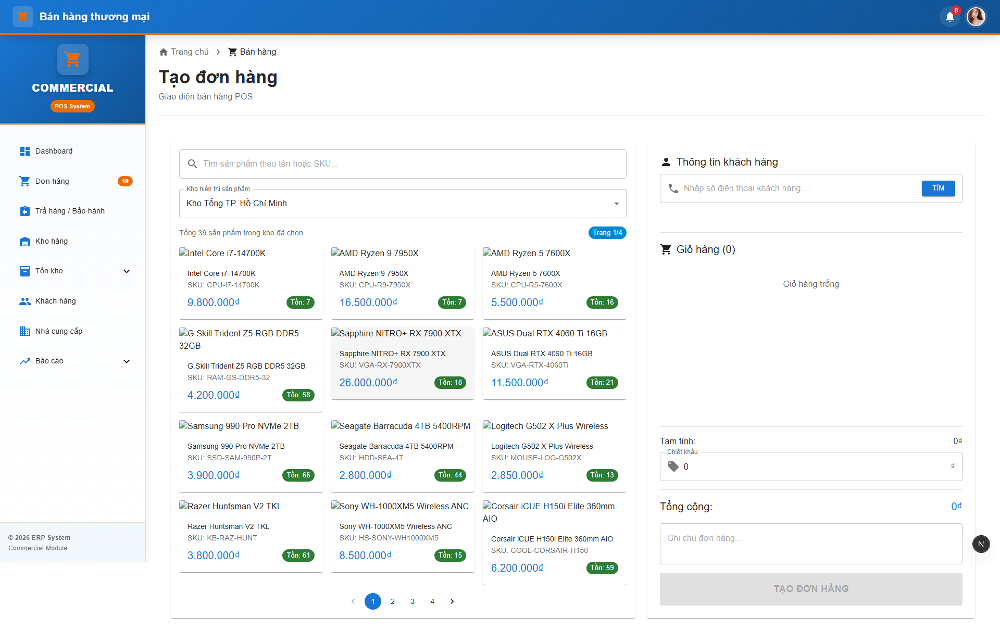


### Bước 2: Mở dropdown kho hiển thị sản phẩm
- Thao tác thực hiện: bấm combobox kho hiển thị sản phẩm.
- Kết quả mong đợi: danh sách kho hiển thị để chọn.

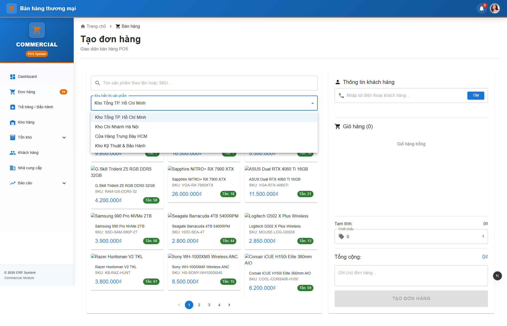


### Bước 3: Tìm sản phẩm theo từ khóa
- Thao tác thực hiện: nhập từ khóa vào ô tìm sản phẩm.
- Kết quả mong đợi: danh sách sản phẩm được lọc.

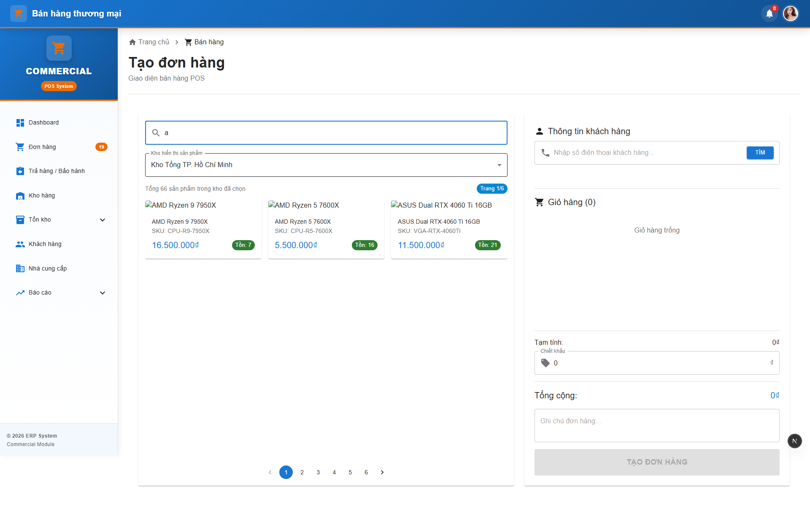


### Bước 4: Thêm sản phẩm vào giỏ
- Thao tác thực hiện: chọn một thẻ sản phẩm từ danh sách.
- Kết quả mong đợi: sản phẩm được đưa vào giỏ hàng.

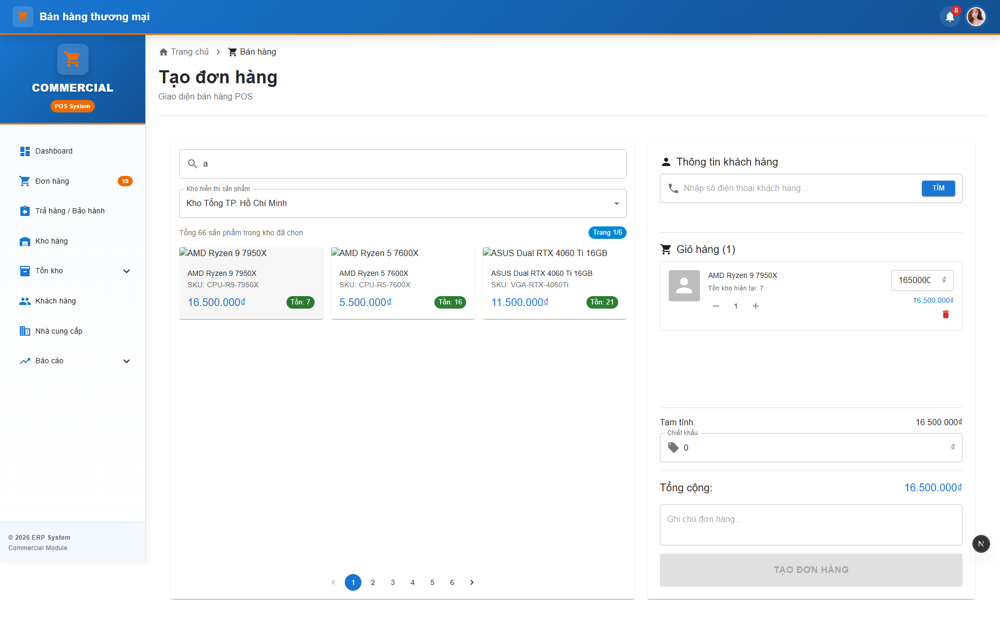


### Bước 5: Tìm khách hàng theo số điện thoại
- Thao tác thực hiện: nhập số điện thoại và bấm tìm.
- Kết quả mong đợi: hệ thống thực hiện tra cứu khách hàng.

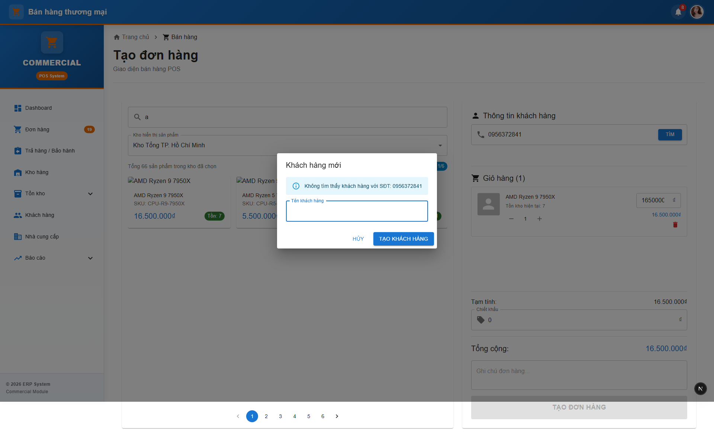


### Bước 6: Nhập chiết khấu và ghi chú đơn
- Thao tác thực hiện: điền chiết khấu và ghi chú đơn hàng.
- Kết quả mong đợi: thông tin đơn hàng được cập nhật trên form.

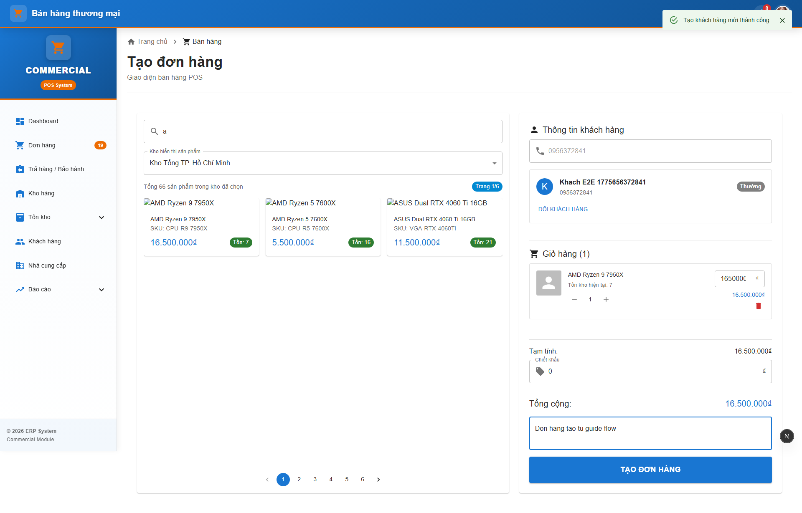


### Bước 7: Sẵn sàng gửi tạo đơn hàng
- Thao tác thực hiện: kiểm tra trạng thái nút Tạo đơn hàng.
- Kết quả mong đợi: form sẵn sàng cho thao tác tạo đơn.


### Bước 8: Quay về danh sách đơn sau tạo
- Thao tác thực hiện: tạo đơn và điều hướng về trang đơn hàng.
- Kết quả mong đợi: danh sách đơn hàng được hiển thị.

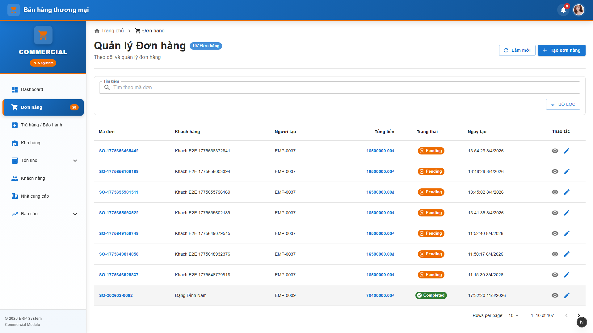


### Bước 9: Mở chi tiết đơn hàng
- Thao tác thực hiện: chọn đơn hàng từ danh sách.
- Kết quả mong đợi: màn hình chi tiết đơn hàng mở thành công.

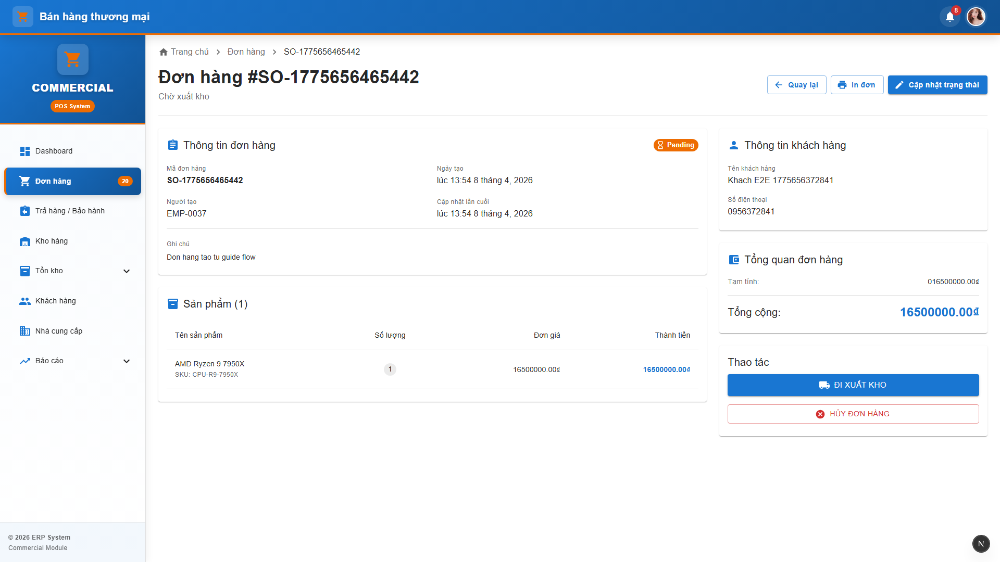


### Bước 10: Điều hướng sang nghiệp vụ xuất kho
- Thao tác thực hiện: bấm Đi xuất kho từ chi tiết đơn.
- Kết quả mong đợi: chuyển sang module xử lý xuất kho.

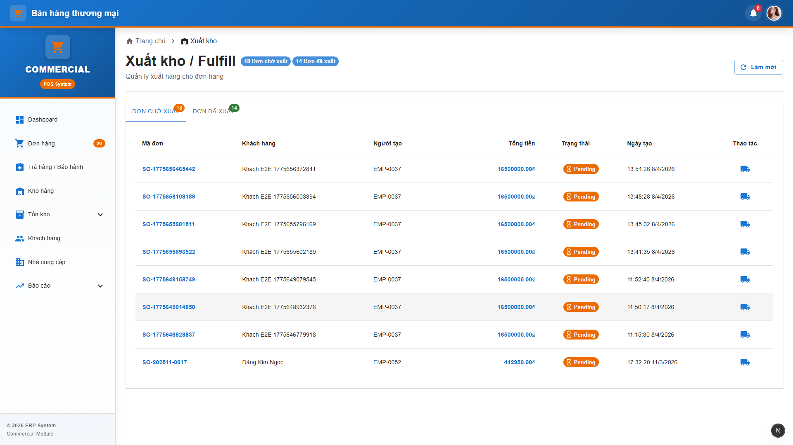


### Bước 11: Xem danh sách đơn chờ xuất
- Thao tác thực hiện: mở trang fulfillment.
- Kết quả mong đợi: hiển thị danh sách đơn chờ xử lý xuất kho.


### Bước 12: Mở dialog xuất hàng
- Thao tác thực hiện: bấm Xuất hàng.
- Kết quả mong đợi: popup xuất kho hiển thị.

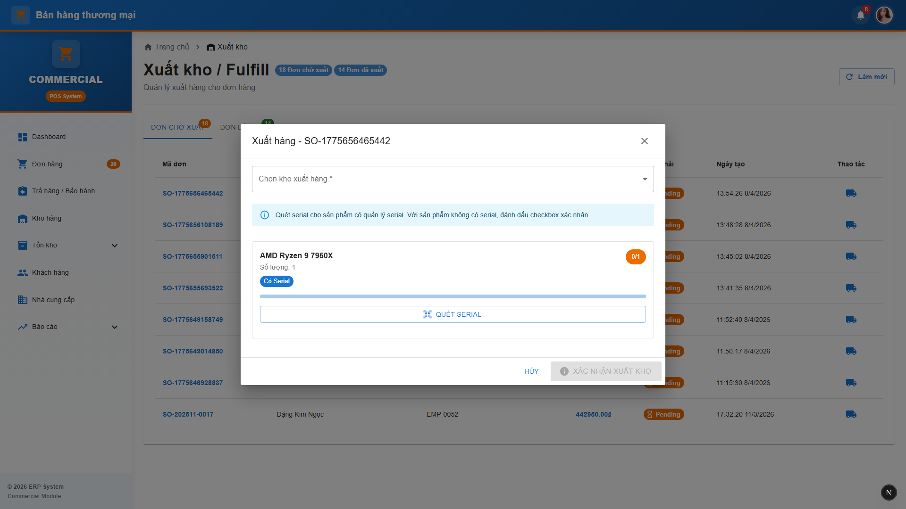


### Bước 13: Chọn kho xuất hàng trong dialog
- Thao tác thực hiện: mở combobox kho và chọn kho.
- Kết quả mong đợi: kho xuất hàng được gán cho phiếu xuất.


### Bước 14: Xác nhận item xuất kho
- Thao tác thực hiện: quét serial hoặc tick xác nhận item.
- Kết quả mong đợi: item được đánh dấu đủ điều kiện xuất.

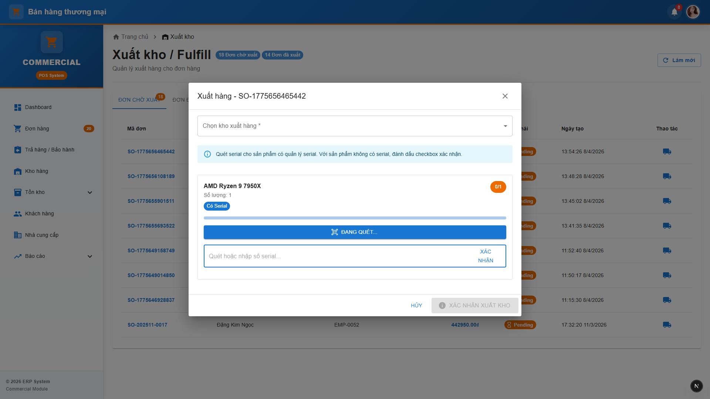


### Bước 15: Kiểm tra trạng thái sau xác nhận xuất kho
- Thao tác thực hiện: bấm xác nhận xuất kho.
- Kết quả mong đợi: hệ thống phản hồi trạng thái sau xử lý.


### Bước 16: Mở danh sách phiếu nhập kho
- Thao tác thực hiện: vào module nhập kho.
- Kết quả mong đợi: hiển thị bảng phiếu nhập hiện có.

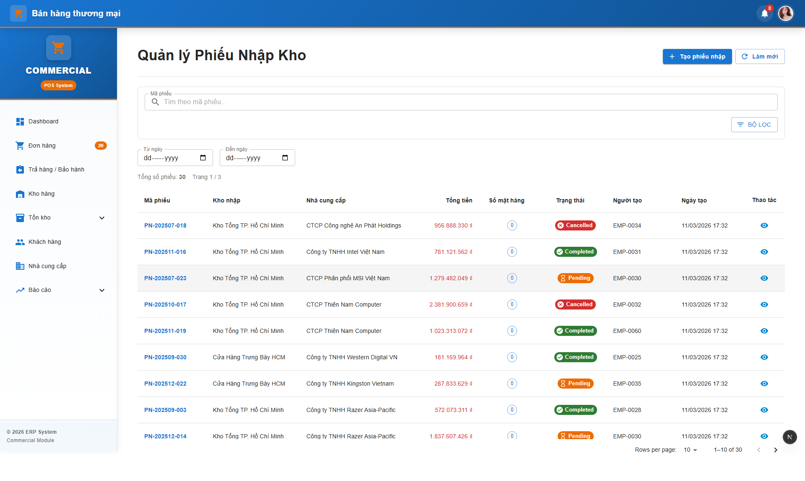


### Bước 17: Mở trang tạo phiếu nhập
- Thao tác thực hiện: bấm Tạo phiếu nhập.
- Kết quả mong đợi: vào màn hình tạo phiếu nhập kho.

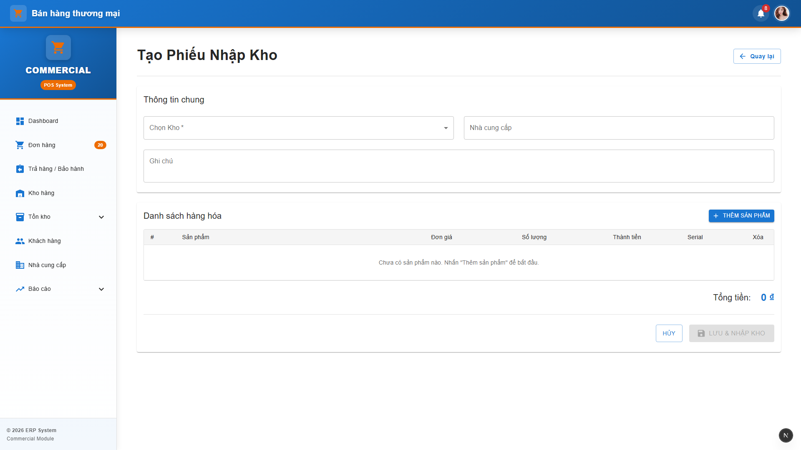


### Bước 18: Điền thông tin đầu phiếu nhập
- Thao tác thực hiện: chọn kho và thao tác trường nhà cung cấp.
- Kết quả mong đợi: phần header phiếu nhập có dữ liệu.

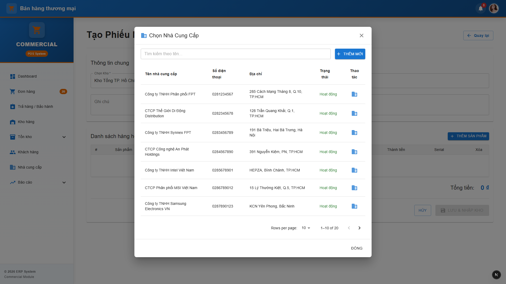


### Bước 19: Thêm dòng sản phẩm nhập
- Thao tác thực hiện: bấm Thêm sản phẩm.
- Kết quả mong đợi: xuất hiện dòng item mới để khai báo.

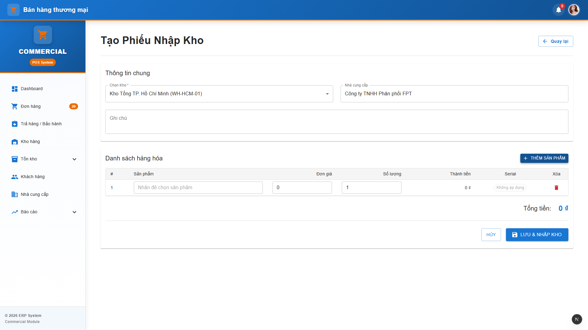


### Bước 20: Mở dialog chọn sản phẩm nhập
- Thao tác thực hiện: bấm vào trường chọn sản phẩm.
- Kết quả mong đợi: popup chọn sản phẩm hiển thị.

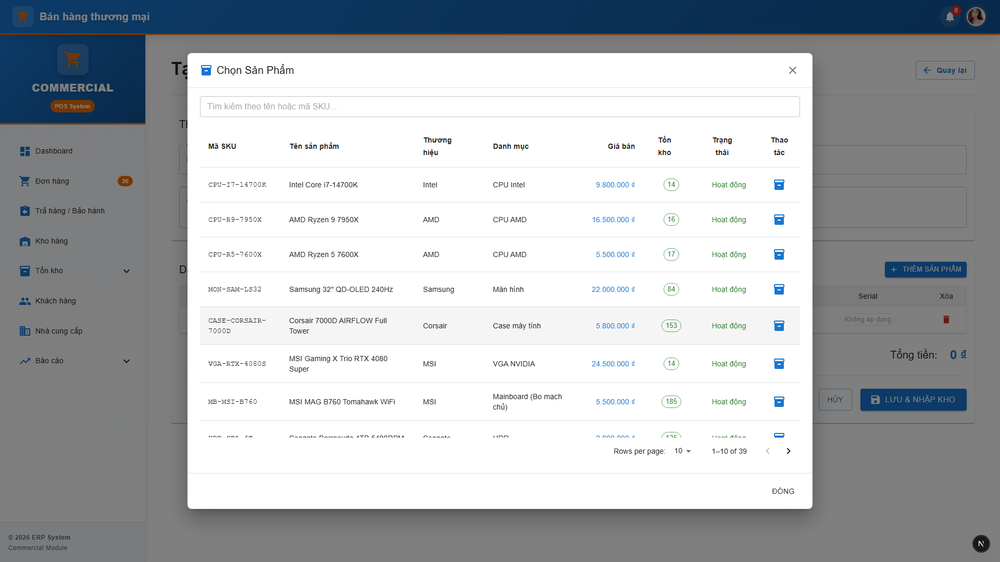


### Bước 21: Điền giá và số lượng nhập
- Thao tác thực hiện: nhập đơn giá và số lượng cho item.
- Kết quả mong đợi: dòng sản phẩm đủ dữ liệu để lưu.

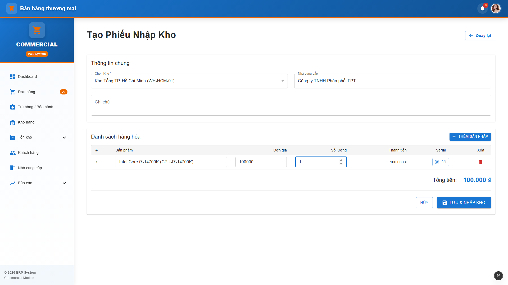


### Bước 22: Thử lưu và nhập kho
- Thao tác thực hiện: bấm Lưu và Nhập kho.
- Kết quả mong đợi: hệ thống tiếp nhận thao tác lưu phiếu nhập.

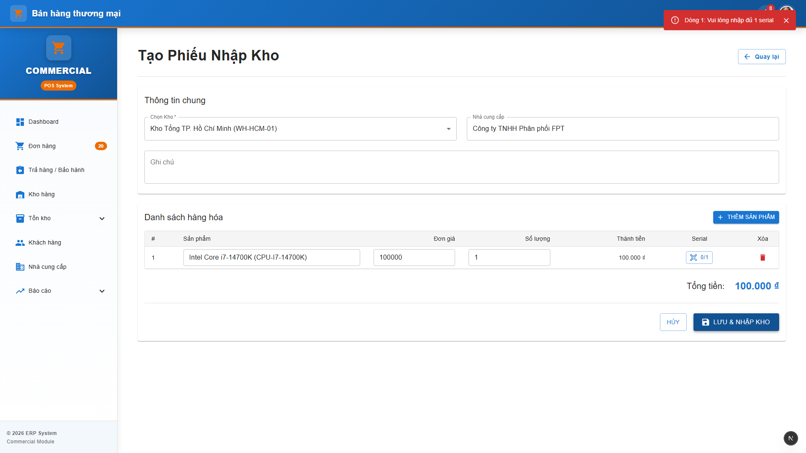


## 4.9 Chức năng 9: Admin nâng cao - CRUD sản phẩm

### Bước 1: Mở danh sách sản phẩm cho CRUD
- Thao tác thực hiện: vào trang quản lý sản phẩm Admin.
- Kết quả mong đợi: hiển thị bảng sản phẩm để thao tác CRUD.

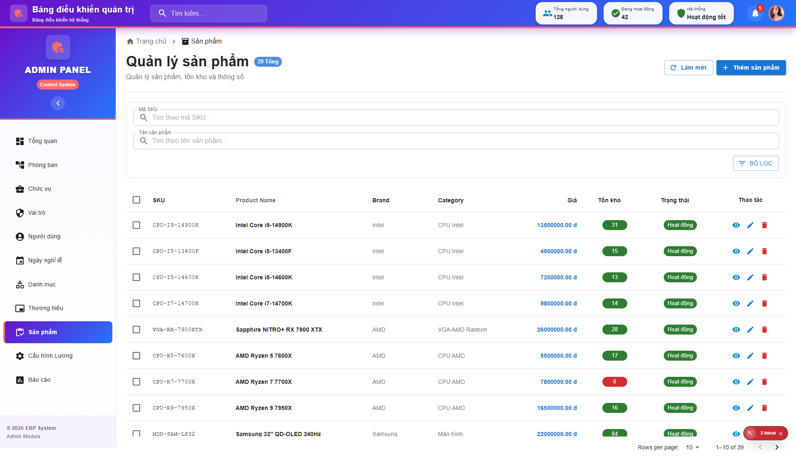


### Bước 2: Mở trang tạo sản phẩm
- Thao tác thực hiện: bấm Thêm sản phẩm.
- Kết quả mong đợi: điều hướng tới form tạo sản phẩm.


### Bước 3: Điền thông tin cơ bản sản phẩm
- Thao tác thực hiện: nhập tên sản phẩm mới.
- Kết quả mong đợi: trường thông tin cơ bản đã có dữ liệu.

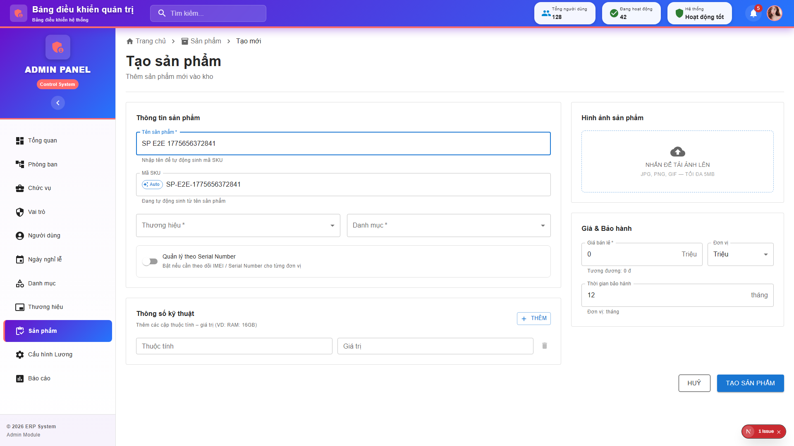


### Bước 4: Kiểm tra validation khi thiếu dữ liệu bắt buộc
- Thao tác thực hiện: bấm Tạo sản phẩm khi chưa điền đủ.
- Kết quả mong đợi: hiển thị lỗi validation bắt buộc.


### Bước 5: Bổ sung đủ trường bắt buộc
- Thao tác thực hiện: chọn thương hiệu, danh mục và giá bán lẻ.
- Kết quả mong đợi: form đạt điều kiện tạo sản phẩm.


### Bước 6: Xác nhận sản phẩm đã tạo trong danh sách
- Thao tác thực hiện: tạo sản phẩm và quay về bảng.
- Kết quả mong đợi: bản ghi sản phẩm mới xuất hiện.


### Bước 7: Mở trang chỉnh sửa sản phẩm
- Thao tác thực hiện: tìm sản phẩm vừa tạo và bấm Sửa.
- Kết quả mong đợi: mở form edit của sản phẩm đó.

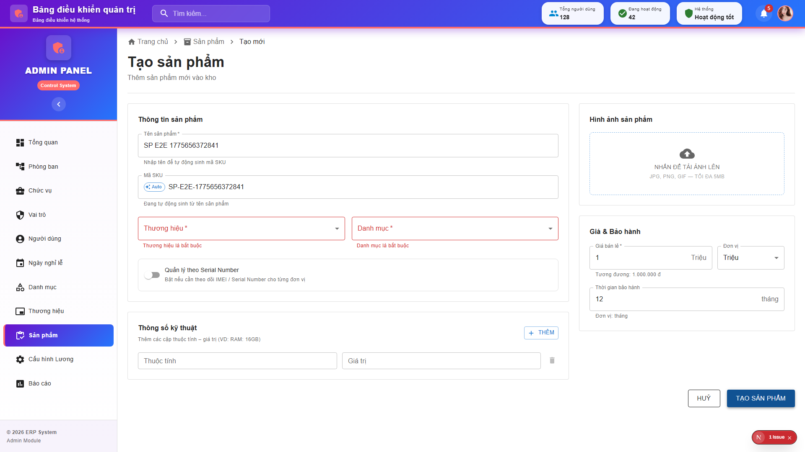


### Bước 8: Cập nhật thông tin sản phẩm
- Thao tác thực hiện: chỉnh sửa giá bán lẻ và lưu.
- Kết quả mong đợi: danh sách phản ánh dữ liệu đã cập nhật.


### Bước 9: Mở xác nhận xóa sản phẩm
- Thao tác thực hiện: chọn sản phẩm và bấm Xóa.
- Kết quả mong đợi: popup xác nhận xóa hiển thị.


### Bước 10: Xóa sản phẩm khỏi danh sách
- Thao tác thực hiện: xác nhận xóa trên popup.
- Kết quả mong đợi: sản phẩm không còn trong danh sách.


## 4.10 Chức năng 10: Personal Portal - Hồ sơ cá nhân, nghỉ phép, phiếu lương, thôi việc

### Bước 1: Mở trang chủ Personal Portal
- Thao tác thực hiện: truy cập portal cá nhân.
- Kết quả mong đợi: hiển thị màn hình tổng quan cá nhân.

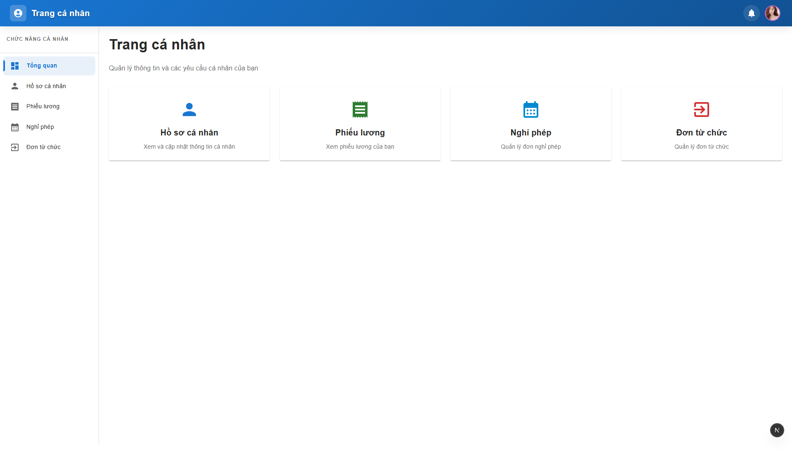


### Bước 2: Quan sát các thẻ thông tin nhanh
- Thao tác thực hiện: kiểm tra khu vực card thông tin.
- Kết quả mong đợi: card hiển thị đúng ngữ cảnh người dùng.


### Bước 3: Mở trang hồ sơ cá nhân
- Thao tác thực hiện: vào mục Hồ sơ.
- Kết quả mong đợi: hiển thị thông tin hồ sơ người dùng.

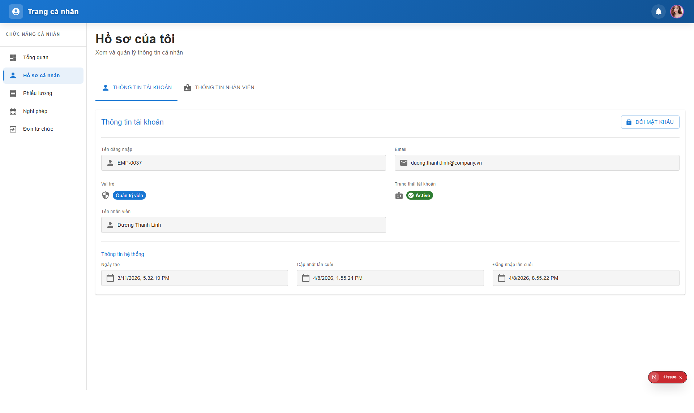


### Bước 4: Mở trang nghỉ phép của tôi
- Thao tác thực hiện: vào mục Nghỉ phép của tôi.
- Kết quả mong đợi: hiển thị danh sách đơn nghỉ phép cá nhân.

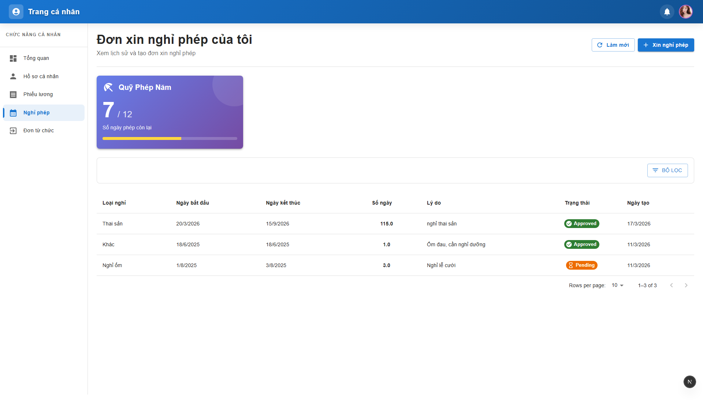


### Bước 5: Mở dialog xin nghỉ phép
- Thao tác thực hiện: bấm Xin nghỉ phép.
- Kết quả mong đợi: popup tạo đơn nghỉ phép xuất hiện.

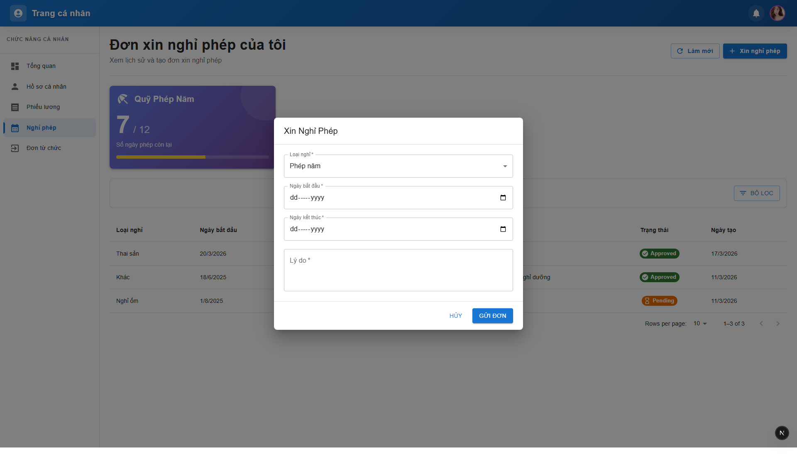


### Bước 6: Kiểm tra validation đơn nghỉ phép
- Thao tác thực hiện: gửi đơn khi chưa nhập đủ dữ liệu.
- Kết quả mong đợi: hiển thị lỗi bắt buộc trên form.

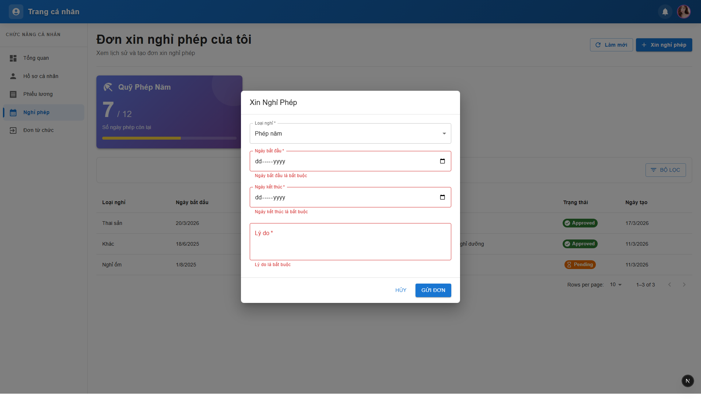


### Bước 7: Mở trang phiếu lương của tôi
- Thao tác thực hiện: truy cập mục Phiếu lương.
- Kết quả mong đợi: hiển thị danh sách phiếu lương cá nhân.

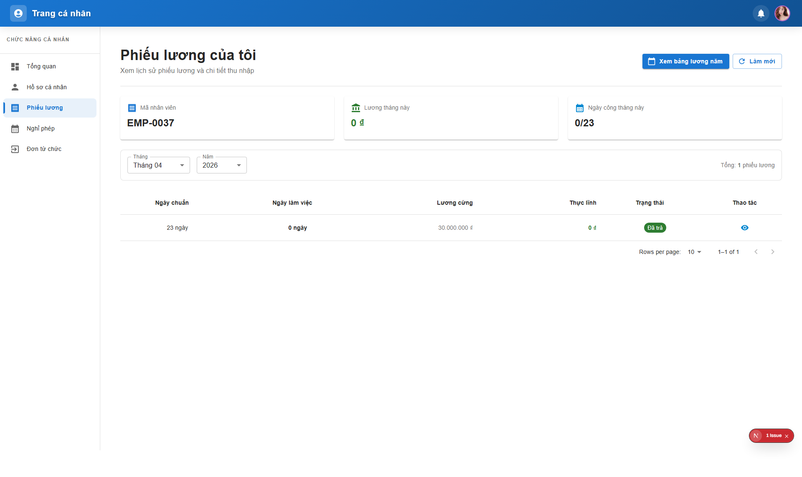


### Bước 8: Mở bộ lọc phiếu lương theo tháng
- Thao tác thực hiện: bấm combobox Tháng.
- Kết quả mong đợi: bộ lọc tháng được mở để chọn.

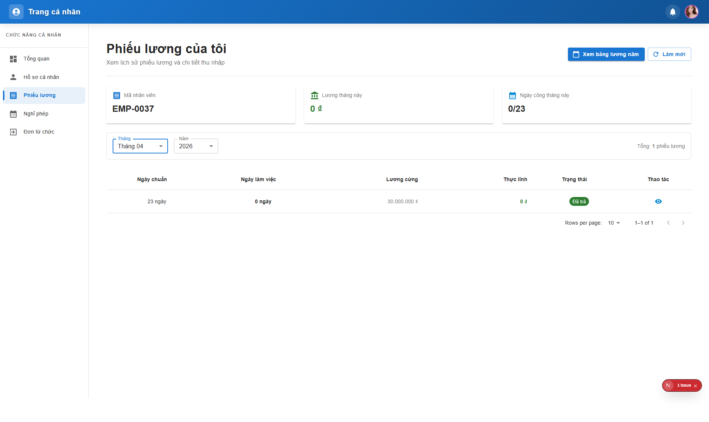


### Bước 9: Mở trang đơn xin thôi việc
- Thao tác thực hiện: vào mục Đơn xin thôi việc.
- Kết quả mong đợi: hiển thị danh sách đơn thôi việc của cá nhân.


### Bước 10: Mở form tạo đơn xin thôi việc
- Thao tác thực hiện: bấm Tạo đơn xin thôi việc.
- Kết quả mong đợi: popup tạo đơn thôi việc xuất hiện.

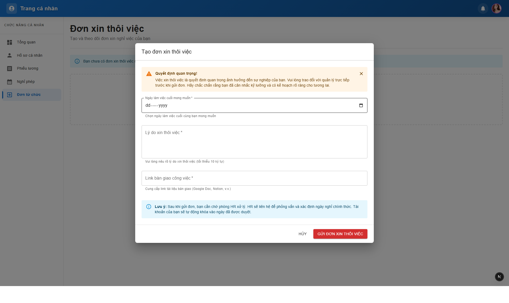


### Bước 11: Kiểm tra validation đơn thôi việc
- Thao tác thực hiện: gửi đơn khi thiếu dữ liệu bắt buộc.
- Kết quả mong đợi: hệ thống hiển thị lỗi validation.

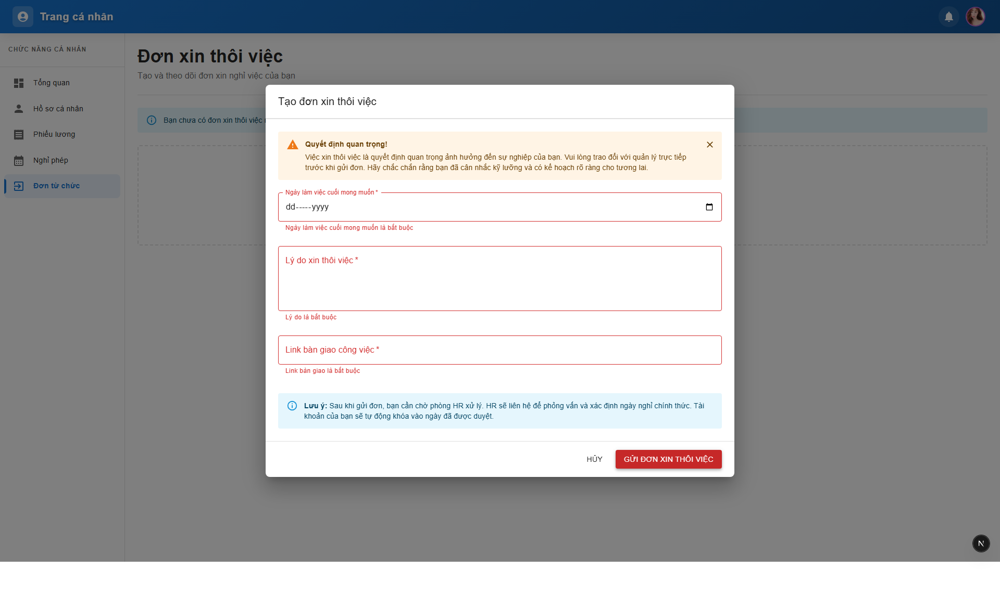


### Bước 12: Đóng form đơn thôi việc
- Thao tác thực hiện: bấm Hủy trên dialog.
- Kết quả mong đợi: dialog đóng và quay lại màn hình danh sách.

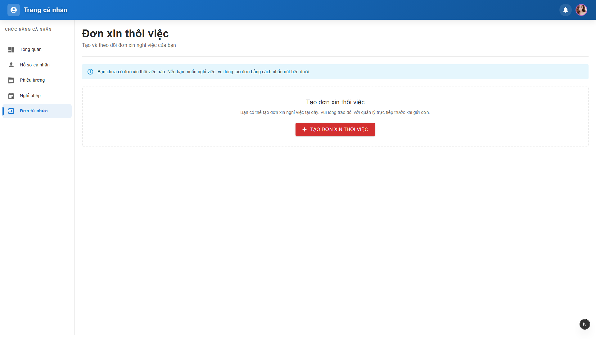


## 5. Hướng dẫn chạy lại để tái tạo tài liệu

### Bước 1: chạy frontend

```bash
npm run export:ui:serve
```

### Bước 2: chạy flow chụp ảnh

Mở terminal khác:

```bash
npx playwright test e2e/guide-flow.spec.ts --config=playwright.export.config.ts
```

### Bước 3: kiểm tra kết quả

1. Có đủ ảnh từ step-01 đến step-98 trong mockups/ui-pages.
2. Ảnh step cũ được dọn trước mỗi lần chạy.
3. Tài liệu này bám trực tiếp vào các ảnh vừa tạo.

## 6. Kiểm tra sau khi thực hiện

1. Đảm bảo không có ảnh bị trắng màn hình hoặc bị treo loading.
2. Đảm bảo tài liệu không còn bước dashboard trong danh mục chức năng.
3. Đảm bảo các chức năng mở rộng (Fulfillment, Nhập kho, CRUD sản phẩm nâng cao, Personal Portal) đều có ảnh minh họa.
4. Nếu có lỗi, kiểm tra thư mục test-results để xác định đúng bước bị fail.
